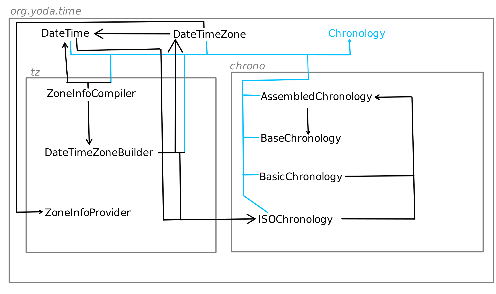
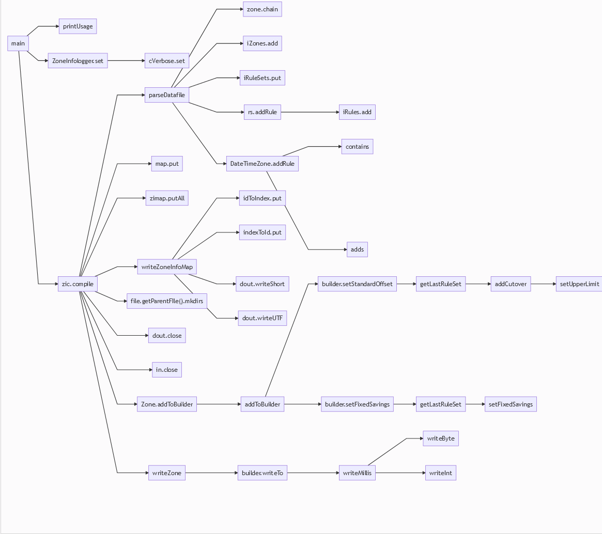
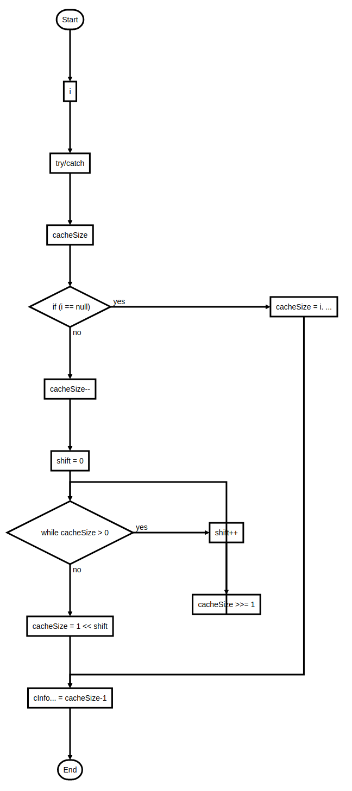
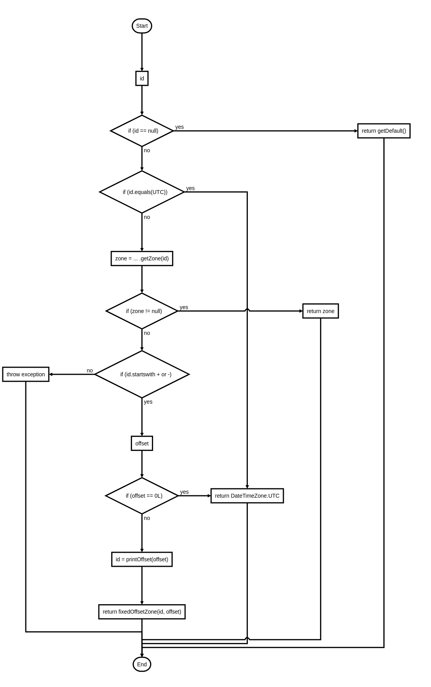
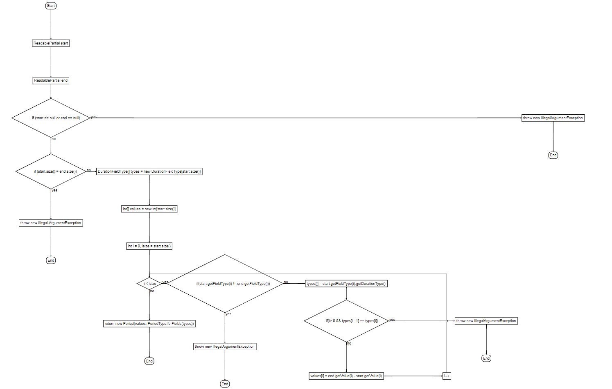
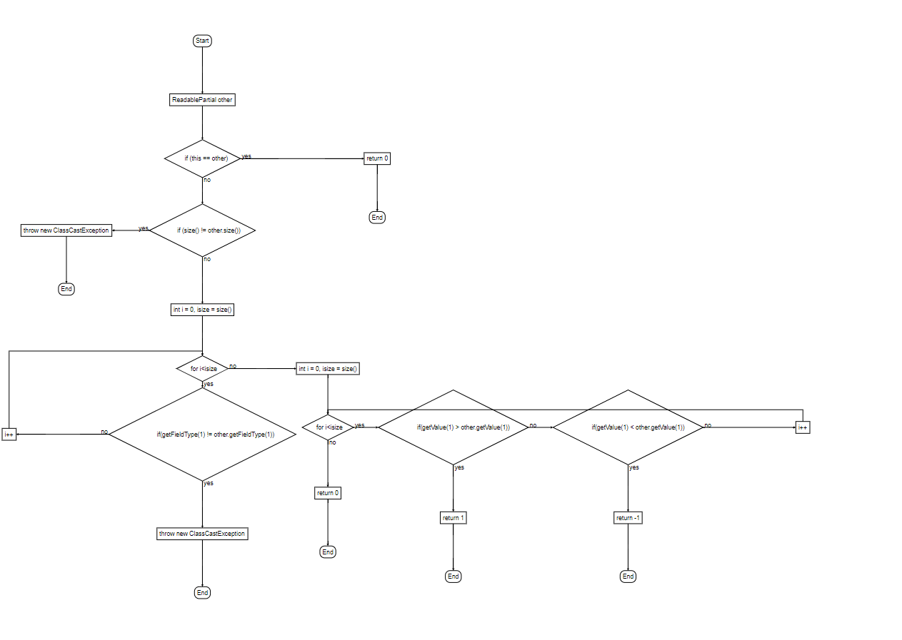

### Assignment 01
### Software Construction HS20
### Group 28: Julia Kostadinova, Madison Montgomery, Oliver Strassmann

Some remarks:
- see inside the "img" folder for screenshots of the code
- this diagrams were created with html+js, the code is inside the "flowchart" folder
- There are multiple end nodes in the for-loops for more readability. 

# Part 1

Why did we choose this packages and classes?  
- org.yoda.time: is the "main package" of the system, because it contains all other packages an classes
- tz: the main function of the system is contained within this package
- chrono: very central package for this system, since it provides all other parts of the system with different time display types, like for example calendar styles
- the classes we chose show a good example of the depencencies found throughout the whole project: specially chronology is a very centric class, which has a lot of usages in the project.
And then there are classes like ZoneInfoProvider, which have very few usages. Or the structure of the following classes "DateTime"->"DateTimeZone"->"DateTimeZoneBuilder" is very typical for the hierarchical way many classes depend on eachother within the system.

## Call graph

# Part 2 
 
## Methods containing if/else statements  

#### From org.joda.time > tz > CachedDateTimeZone static (line 36)

#### From org.joda.time > DateTimeZone > public Static DateTimeZone forID(String id)  

#### From org.joda.time > field > RemainderDateTimeField > public ReminderDateTimeField (DateTimeField field, DateTimeFieldType type, int divisor) 

#### From org.joda.time > convert > ConverterSet > ConverterSet remove(final int index, Converter[] removed)

## Methods containing for loops
#### From org.joda.time > Period > public Static Period fieldDifference(ReadablePartial start, ReadablePartial end)

#### From org.joda.time > Abstract Partial > public int compareTo(ReadablePartial other)

