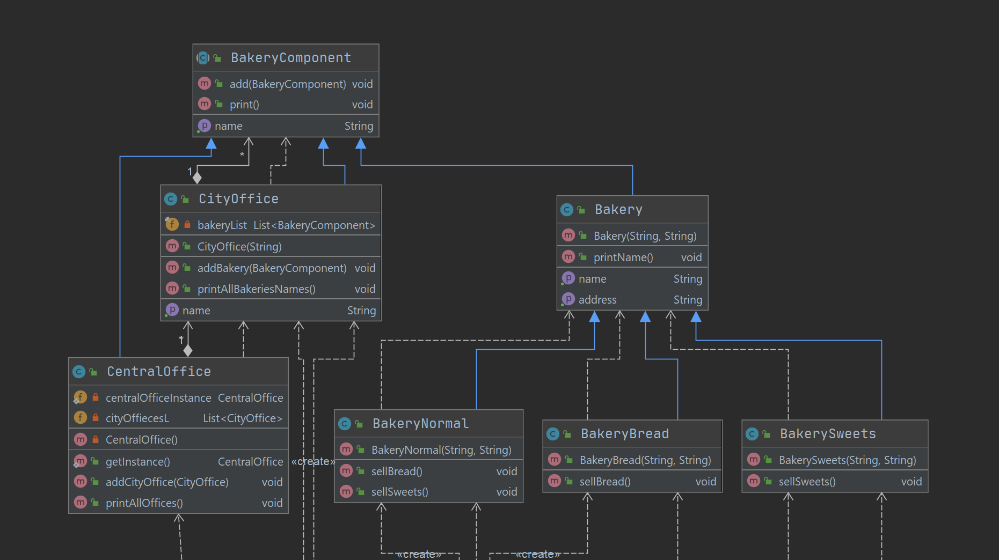

### Assignment 5
### Software Construction HS20
### Group 28: Julia Kostadinova, Madison Montgomery, Oliver Strassmann

## Decorator pattern
- how  
This pattern is implemented in the cake and sandwich packages. The CakeDecorator class and SandwichDecorator class extends the abstract component classes Cake and Sandwich respectively as a super class. Each topping option has its own decorator subclass that extend the SandwichDecorator and CakeDecorator classes. The getDescription() and cost() methods within the decorator subclasses will then add to the description and cost of that cake or sandwich instance.

- why  
We use the Decorator pattern for sandwiches and cakes so that we can customize instances of these classes with toppings without affecting the base class or creating an inefficient number of classes to address every topping combination. 

## Composite pattern
- how  
The general component here is called "BakeryComponent".  
The 3 classes, CityOffice, CentralOffice and Bakery extend this component.
We mainly made use of the composite for the print methods, which don't have to keep track of all different types each of the composites.

- why  
Instead of creating different methods for the "add()" and "print()" (printCityOffice(), printCentralOffice() etc.), we can use here the composite pattern 
so we have 1 method name across all composites. This was not completely possible though because of the given name 
for these methods "printAllBakeries()", "printAllOffices()". But the principle is still the same, as if we could've chosen "print()" 
 for the name of the method across all composites.  
  Implementing the composite for example for the bakeries (sweets, normal, bread) would yield no additional advantage in this assignment, since we cover all we need through normal inheritance.

## Strategy pattern
- how  
This pattern is implemented throughout the packages Vehicle and VehicleBehaviour. In this specific instance the Client is the Vehicles stored in the Package, where there is a general Vehicle that implements all the given behaviours. Its subclasses with specific vehicles 
that implement the necessary behaviours in the constructor.
Those Behaviours are separated from their initial Class. In this case these Behaviours exist as four different kinds: Fuel, Luggage, Pricing and Speed. They are implemented as Interfaces with their specific behaviour-classes.

- why  
The main use of this pattern lies in its easy changeability. So if we want to make new vehicles for example a  small Supercar. We can just add a new Subclass to Vehicles and implement a new Constructor that has all necessary components. 
The same easiness applies to adding a new behaviour aswell. For example if you want to add a new kind of Speed, like hyper-speed, not much code has to be changed for that.
So basically it gives a way to deal with changing code, and gives a variety of possible combinations if you want to use certain old components from already existing code with less repeating code.