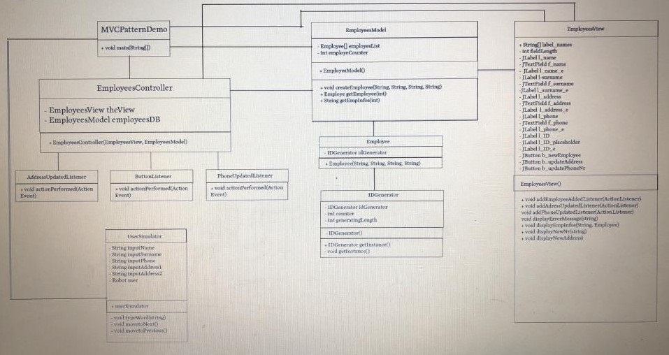
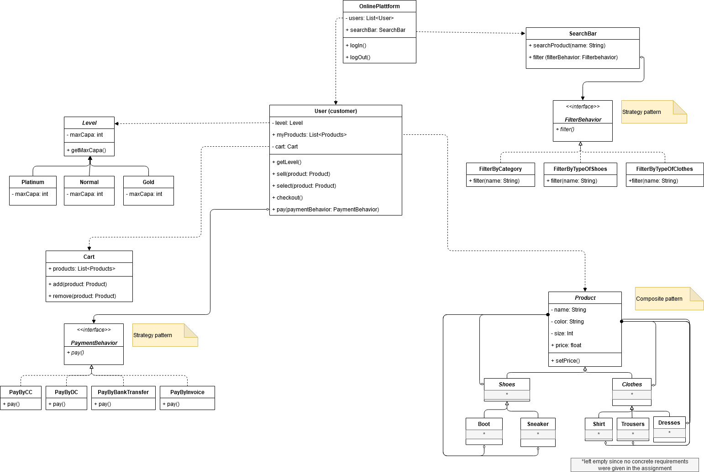

### Assignment 6
### Software Construction HS20
### Group 28: Julia Kostadinova, Madison Montgomery, Oliver Strassmann

##Exercise 1
### UML:

##Exercise 2
### UML:

### Description of the design choices
The usage of the rdd method to derive the structure of the Online Platform resulted
in the UML class diagram above. To see how we got to this result we will describe our choices below.
#### User 
To start with a central component, the user class handles all actions that depend on a customer or seller interacting with the system, since the user is both.
Since there are different levels, every user object will store the customer level. Also, every user has a List of Products that stores items which can be sold by the user.
Furthermore, the User has a cart that stores all items that will be possibly bought. Those things are all stored with the user due to them being directly tied to the person.
A person chooses what to buy, to look out for or to sell. This is reflected by the methods.

"getLevel()" is used tho show the current user capacity of selling things. The capacity has influence on "myProducts". 
"sell(product: Product)", "select(product: Product)", "checkout()" and "pay(paymentBehaviour: PaymentBehaviour)" all
handle the specific users choices and selections.

#### Level
The Level class and its subclasses Platinum, Normal and Gold handle the limits of possible products that can be sold by a user at the same time.
Currently, this is implemented using inheritance since it seems straight forward. 

#### Cart
The Cart class is used to handle the potential products that could be purchased by a User. It comes with the methods add and remove
that make manipulation to the Cart possible if a person decides to remove or to add a product to it and from it.

 
#### OnlinePlatform
The OnlinePlatform handles functions that are not limited to a specific user. It uses the search bar that enables all visitors of the platform to search and filter for products.
It makes sense that the search is not coupled to only users, since it enables every visitor to use the Searchbar. It is also an incentive for
a visitor to become a new user, which creates more traffic for the platform.
Another responsibility of the Platform itself is handling log in and log out with the given methods, which handle access to more functions of the platform (user class).

#### Searchbar and Filtering
The Searchbar class is responsible for searching and filtering. It implements the searching method itself, but the filtering is handled separately due to the different filter options.

The idea here to implement the different filters is to use the Strategy pattern to implement the three possible filtering behaviours.
So there is the Interface FilterBehaviour that is implemented by the three different filters. This enables the platform to implement more filters if there are new kinds of products that can be sold on the platform,
so it would keep the code good for updates. We kept the filters decoupled.

#### PaymentBehaviour and its implementations
We chose to have the Payment using a Strategy pattern as well, since the forms of payment depicted by the different classes implementing the behaviour can be changed by a User.
The thought processes behind this is additionally to the mentioned interchangeability of the payment method, the different kind of implementations:
paying by ByInvoice is completely different from paying by CreditCard or DebitCard. 

#### Product and its specific implementations
The Product class is responsible for handling the different properties of the Products. The superclass Product 
is responsible for all properties that all products share, like the color, name, size and price. The product also gives the method setPrice that enables a User to specify a price. 
The current idea is to have clothes and shoes as subclasses, as although it is a distinction, clothes and shoes are still general terms that can be divided into further sections.
As per the assignment, the sections implemented for more specific shoes and clothes are the shown classes in the UML.
The distinction enables the implementation of specific methods for a respective class depending on how specific the property of that class is.
As an example, it would be possible to add specific boot lengths like long boots or short boots, or in a case of clothes, specifying the occasion of the clothing such as casual dresses vs festive dresses. 

The Product class and its subclasses are candidates for the Composite pattern, if we take into account that both have similar properties
like size, where clothes could measure for example "L" or "XL" or child sizes and shoes are measured as "40" or "43". 
This way content can be different for the same property.   

